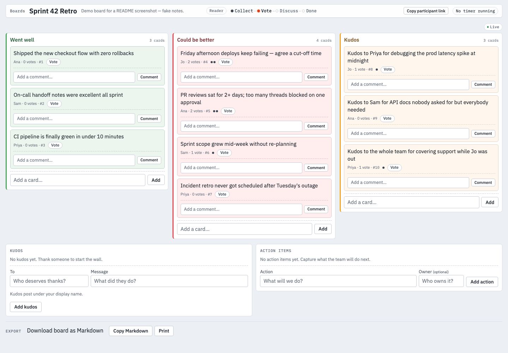

# Hindsight

Self-hosted team retrospective boards in one binary. Create a board from a
retro template, share the link, and the team adds cards, votes, discusses,
and leaves with action items — live in every browser, no accounts.

Boards run through a fixed loop: collect cards → vote → discuss → done,
with blind collection, timers, grouping, kudos, comments, action items,
and markdown export along the way.



## Quickstart (Docker)

Build once, then run with a named volume so boards survive restarts:

```sh
docker build -t hindsight .
docker run -d --name hindsight \
  -v hindsight-data:/data -p 8080:8080 hindsight
```

Open [http://localhost:8080](http://localhost:8080), hit **Start a new retro**,
and share the board link with your team.

With compose (same volume + port wiring, restarts unless stopped):

```sh
docker compose up -d --build
```

## Run locally (Go)

Requires Go 1.26+:

```sh
go generate ./...
go run .                 # serves on :8080, DB at ./data/hindsight.db
```

Configuration is two optional environment variables, nothing else:

| Variable  | Default                | Meaning                    |
|-----------|------------------------|----------------------------|
| `PORT`    | `8080`                 | HTTP listen port           |
| `DB_PATH` | `./data/hindsight.db`  | SQLite file (dirs created) |

The container image sets `DB_PATH=/data/hindsight.db` so the database
lands on the volume. Point `DB_PATH` anywhere else to keep the file
next to the binary or on another mount.

## Develop

```sh
make build   # compile the binary
make test    # unit tests with -race
make check   # full gate: fmt-check + codegen + hashes + vet + test + lint
```

`make lint` needs golangci-lint v2.13.2 (the `Makefile` prints the
install line when it is missing); `gofmt` and `go vet` must be clean.
The binding contract — package layering, route table, SSE protocol,
auth, and error shape — lives in [ARCHITECTURE.md](ARCHITECTURE.md)
and is partly machine-checked by the linter, so read it before
restructuring anything.

End-to-end tests are Playwright, chromium only (needs Node):

```sh
make e2e-setup   # npm ci + install chromium (once)
make e2e         # boots the server, runs e2e/tests
```

## Share a board over ngrok

The app is built for tunneled sharing: one `EventSource` per board page,
a `:ping` heartbeat every 12s to keep idle streams alive, and automatic
resync — a viewer that drops (laptop sleep, ngrok restart) replays
missed events from the board's event buffer, or refetches all columns
when the gap is too old. No ngrok config needed:

```sh
ngrok http 8080
```

Send teammates the board link (`/b/<id>`). Remote votes, cards, and
comments land in every open browser in under a second.

## Facilitator tokens

There are no accounts. Each board has two secrets:

- **Share link** (`/b/<id>`) — anyone with it joins by picking a display
  name (duplicates get suffixed: `ana`, `ana-2`, …).
- **Facilitator token** — shown exactly once, on the board view right
  after creation. It unlocks phases, reveal, locks, the timer, focus,
  archive, and duplicate. The facilitator link (`/b/<id>?fac=<token>`)
  carries it; opening that link on another device claims facilitator
  rights there too.

Both live in signed year-long cookies (`hindsight_fac`,
`hindsight_parts`); only hashes persist server-side. Treat the
facilitator link like a password: anyone holding it facilitates.
If it leaks, rotate it from the board (regenerate) — the old token
stops working immediately.

## Backup and restore

The whole state is one SQLite file. To back up, stop the writer first
so the write-ahead log settles, then copy the file:

```sh
# compose / container (volume hindsight-data)
docker compose stop
docker run --rm -v hindsight-data:/data -v "$PWD":/backup \
  alpine cp /data/hindsight.db /backup/hindsight-$(date +%F).db
docker compose start
```

```sh
# local run
cp ./data/hindsight.db ./hindsight-backup.db
```

To restore, stop the app, copy the backup over `DB_PATH`
(`/data/hindsight.db` in the container), and start again. Copy the
`-wal`/`-shm` sidecars too if they exist; with the app stopped there
is normally just the one file.

## Limits and v1 scope

- **No-auth model is gameable, by design.** Display names plus cookies
  mean cookie replay or name impersonation is possible — same tradeoff
  as free hosted retro boards. Fine for a trusted team; not for
  adversarial settings.
- **Fresh clients converge, stale ones refetch.** Votes and card edits
  swap in place; reveal, sort, and reconnects refetch whole columns.
- **Abuse guards are modest.** Adds, comments, and votes are capped per
  client (30-request burst, then ~1/second, 429 + on-screen notice on
  excess); inputs have length caps (cards 2000, comments 1000, kudos
  and actions 500 chars). Client identity prefers `X-Forwarded-For`
  (required behind proxies like ngrok, where every connection looks
  like the proxy), so a client can join another IP's bucket — no auth
  impact, the limits only dampen abuse.
- **Export is markdown only** (plus a print stylesheet for PDF-via-
  browser). Explicitly deferred: native PDF/PNG/DOCX rendering,
  Jira/Slack integrations, surveys and health checks, teams/orgs,
  custom CSS, and accounts/auth hardening.
